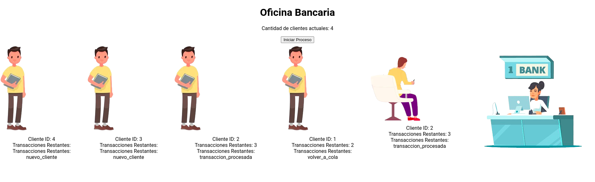

---

# Gestión de Estructuras de Datos: Simulación de Atención Bancaria (Colas)

Este proyecto implementa una API RESTful con Python (Flask) como backend y React como frontend para simular la atención de clientes en una oficina bancaria utilizando estructuras de datos tipo **cola**.

## Características

- Simulación de atención por turnos basada en una cola FIFO.
- Representación visual del estado de cada cliente (nuevo, en atención, en espera, completado).
- Simulación de múltiples transacciones por cliente.
- API desarrollada con Flask y consumo de datos en tiempo real desde React.
- Control visual de flujo de atención en una interfaz simple.

## Tecnologías Utilizadas

**Backend:**

- Python 3
- Flask
- Flask-CORS
- Cola (Queue) del módulo estándar
- Threading

**Frontend:**

- React
- Fetch API
- Hooks (`useState`, `useEffect`)

## Estructura del Proyecto

```
.
├── backend/
│   └── app.py                # Lógica de la simulación y servidor Flask
├── frontend/
│   ├── components/
│   │   └── OficinaBanco.jsx  # Visualización de la simulación en React
│   └── images/               # Imágenes de los clientes y cajero
└── README.md                 # Documentación del proyecto
```

## Instalación y Ejecución

### Backend

1. Clonar el repositorio.
2. Instalar las dependencias necesarias:

```bash
pip install flask flask-cors
```

3. Ejecutar el servidor:

```bash
python app.py
```

Esto iniciará el backend en `http://localhost:5000`.

### Frontend

1. Moverse al directorio del frontend (si está separado).
2. Instalar dependencias de React:

```bash
npm install
```

3. Ejecutar la aplicación:

```bash
npm start
```

Esto levantará la interfaz React en `http://localhost:3000`.

## Endpoints de la API

- `GET /api`\
  Devuelve los eventos de la simulación en formato JSON.

- `POST /clients`\
  Reinicia la simulación si ha finalizado.

## Lógica de la Simulación

- Se generan clientes con entre 1 y 5 transacciones.
- Cada cliente es atendido hasta por 3 transacciones por turno.
- Si tiene más transacciones, regresa al final de la cola.
- La simulación finaliza cuando ya no hay más generaciones de clientes ni clientes en cola.

## Interfaz Gráfica



## Consideraciones

- Se utiliza `Thread` para correr la simulación en paralelo al servidor Flask.
- La actualización del frontend se realiza cada 100 ms.
- La interfaz React filtra automáticamente los clientes que han finalizado.


## Licencia

This project is licensed under the Creative Commons Attribution-NonCommercial-ShareAlike 4.0 International (CC BY-NC-SA 4.0) license.

You are free to:

Share — copy and redistribute the material in any medium or format.
Adapt — remix, transform, and build upon the material.
Under the following terms:

Attribution — You must give appropriate credit, provide a link to the license, and indicate if changes were made. You may do so in any reasonable manner, but not in any way that suggests the licensor endorses you or your use.
NonCommercial — You may not use the material for commercial purposes.
ShareAlike — If you remix, transform, or build upon the material, you must distribute your contributions under the same license as the original.
Read more about this license at CC BY-NC-SA 4.0.
